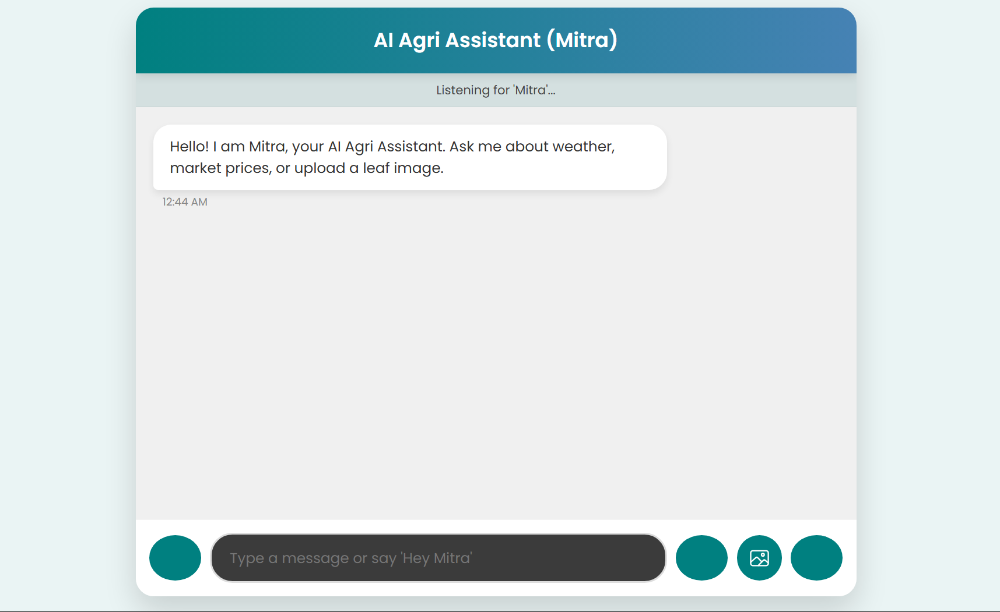

<div align="center">

# 🌿 Mitra – AI Agri Assistant

### AI-Powered Multimodal Agricultural Assistant for Indian Farmers 🇮🇳

Mitra is a full-stack, microservices-based AI assistant designed to empower farmers with intelligent insights through voice, image, and text interactions.

Built with ❤️ using Spring Boot, Flask, React, TensorFlow, Whisper, and Transformer models.


</div>

---

# 🎯 Project Vision

Indian farmers often lack access to:

- Accurate crop disease diagnosis
- Real-time mandi (market) prices
- Weather-aware farming advisory
- Simple natural language assistance

**Mitra bridges that gap using AI, NLP, Computer Vision, and real-time APIs.**

---

# ✨ Key Features

- 🎤 Wake-word activated voice queries  
- 📷 Leaf disease detection (MobileNetV2)  
- 💬 AI-powered agricultural Q&A  
- 🌦️ Weather-based crop advisory  
- 📊 Real-time mandi prices  
- 🔊 Text-to-speech responses  
- 🧠 Microservices architecture  

---

# 🏗️ System Architecture

Frontend (React) – 5173
↓
Spring Boot Orchestrator – 8082
↓
| Text AI (Flask) – 5000
| Voice AI (Flask) – 5001
| Image AI (Flask) – 5002
| Market API (Flask) – 5004
    ↓

Weather Service (Spring Boot) – 8080


Each component runs independently and communicates via REST APIs.

---

# 🧠 AI Models Used

## 🌿 Disease Detection
- MobileNetV2 (Transfer Learning)
- TensorFlow / Keras
- PlantVillage dataset

## 🎤 Voice Recognition
- OpenAI Whisper (medium)
- Local transcription

## 💬 Agricultural Q&A
- Google FLAN-T5-Large
- Hugging Face Transformers
- Beam search decoding

## 🌦️ Weather Advisory
- OpenWeatherMap API
- Structured prompt → FLAN-T5

## 📊 Market Prices
- data.gov.in (Agmarknet API)

---

# 🖼️ Screenshots

## Chat Interface



---

# 🚀 Getting Started

## Clone Repository

```bash
git clone https://github.com/hariprasanth5002/Mitra-AI-Agri-Assistant.git
cd Mitra-AI-Agri-Assistant
Start Python Services
cd text
pip install -r requirements.txt
python app.py
cd Voice
pip install -r requirements.txt
python app.py
cd Image
pip install -r requirements.txt
python app.py
python agmarknet.py
Start Spring Boot Services
cd chatbot/chatbot
mvnw.cmd spring-boot:run
cd Weather/demo
mvnw.cmd spring-boot:run
Start Frontend
cd chatbot-ui
npm install
npm run dev

Open in browser:

http://localhost:5173
⚙️ Environment Configuration

Create a .env file:

AGMARKNET_API_KEY=your_key_here
OPENWEATHER_API_KEY=your_key_here

⚠ Never commit API keys.

📦 Model Setup

Download trained MobileNetV2 model:

👉 https://drive.google.com/file/d/1Fvg2ltaywd8EFfgemCbBx46OngphAGpz/view?usp=drive_link

Place it at:

Image/mobilenet_model.keras

Whisper and FLAN-T5 download automatically.

🛠️ Tech Stack

Frontend:

React 19

Vite

Web Speech API

MediaRecorder API

Backend:

Spring Boot 3.5

Java 17

Spring WebFlux

AI:

TensorFlow

PyTorch

Hugging Face Transformers

OpenAI Whisper

Database:

MySQL 8

🔐 Security Notes

Store API keys in .env

Do not commit secrets

Model weights excluded from version control

Whisper runs locally

📄 License

MIT License

👤 Author

Hariprasanth U
https://github.com/hariprasanth5002

<div align="center"> Made with ❤️ for Indian Farmers 🌾 </div> ```